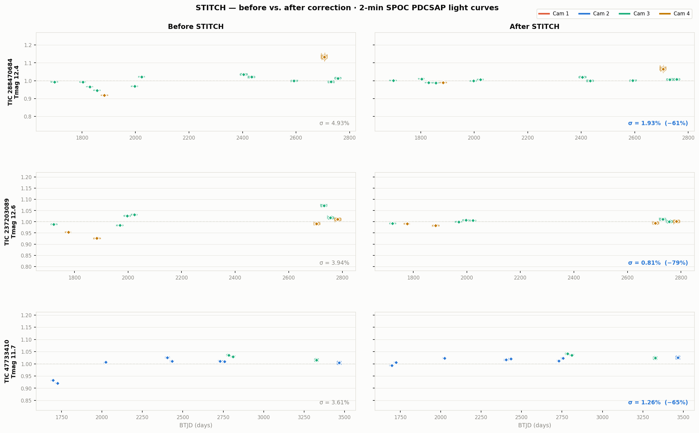

# STITCH

**S**ector-**T**o-sector **I**ntercalibration via **T**rained **C**onditional **H**omogenization

STITCH uses conditional normalizing flows to correct cross-sector flux offsets in TESS photometry. For each sector observation of a star, STITCH predicts the multiplicative flux offset introduced by that sector's detector position, then divides it out — stitching multi-sector light curves into a coherent baseline without discarding astrophysical signal.



*Each row is a held-out test star. Diamonds mark sector medians. σ values are the cross-sector scatter before and after correction.*

---

## How it works

STITCH models the distribution `p(flux_offset | context)` using a Neural Spline Flow (NSF). The context vector encodes detector position, pixel sub-position, TESS magnitude, crowding, noise level, and camera/CCD identity. The target `flux_offset` is a leave-one-out ratio: the sector median divided by the mean of all other sectors for the same star.

At inference time, STITCH samples 500 draws from the predicted distribution, averages them, and applies shrinkage toward 1.0 proportional to prediction uncertainty.

---

## Setup

```bash
pip install -r requirements.txt
```

The training pipeline downloads TESS light curves from MAST via `lightkurve`. A MAST account is not required for public data.

---

## Pipeline

### 1. Build the quiet-star catalog

Filters TARS Table 4 for photometrically quiet stars (high `systematic_score`) suitable as training targets. Requires `tars_table_4.feather` locally or downloads it from Zenodo on first run.

```bash
python3 build_tars_catalog.py
# outputs: tars_quiet_tics_v2.csv
```

### 2. Collect training data

Downloads SPOC 2-minute PDCSAP light curves from MAST and computes leave-one-out flux offsets and detector context features per sector. Supports parallel sharding for large runs.

```bash
# Single process
python3 collect_training_data_v2.py

# Parallel (4 shards) — run each in a separate terminal
python3 collect_training_data_v2.py --shard 0 4
python3 collect_training_data_v2.py --shard 1 4
python3 collect_training_data_v2.py --shard 2 4
python3 collect_training_data_v2.py --shard 3 4

# outputs: training_data.parquet
```

### 3. Train the flow

Trains a Neural Spline Flow on the collected sector records. Uses an 80/10/10 TIC-stratified split (by camera) so stars are either entirely in train, val, or test — no data leakage across sectors of the same star.

```bash
python3 train_flow_nsf.py
# outputs: stitch_nsf.pt
```

Training takes ~30 minutes on a GPU (MPS or CUDA). On CPU, expect several hours.

### 4. Evaluate on held-out test stars

Reconstructs the exact train/val/test split from training and evaluates STITCH, a naive endpoint baseline, and raw scatter on the 10% held-out test TICs.

```bash
python3 evaluate_held_out.py
# outputs: stitch_eval_held_out.png
```

### 5. Run inference on a new star

Downloads all available SPOC 2-min sectors for a TIC and produces a before/after plot.

```bash
python3 infer_star.py <TIC_ID>
# example: python3 infer_star.py 298091708
# outputs: stitch_tic<TIC_ID>.png
```

---

## Key design decisions

**SPOC PDCSAP only.** QLP normalizes each sector independently, which removes the cross-sector offsets that STITCH models. FFI-based pipelines (e.g., unpopular, TGLC) are a different input regime. STITCH operates on 2-minute cadence SPOC PDCSAP flux exclusively.

**Leave-one-out target.** The training target for sector *i* is `median(sector_i) / mean(medians of all other sectors)`. This is computable without knowing ground truth and provides a self-consistent label that degrades gracefully as sector count increases.

**Quiet-star training data.** STITCH trains on stars flagged as photometrically quiet by the TARS classifier (`systematic_score > 0.95`), so the leave-one-out offset reflects detector systematics rather than stellar variability.

**Shrinkage at inference.** Predictions are blended toward 1.0 (no correction) by `weight = 1 / (1 + 5σ)`, where σ is the per-sector prediction standard deviation across 500 flow samples. High-uncertainty predictions are automatically dampened.

---

## Repository structure

```
infer_star.py                 — single-star inference and plotting (start here)

data/
  build_tars_catalog.py       — quiet-star catalog from TARS Table 4
  find_training_stars.py      — alternative MAST-first catalog builder
  collect_training_data_v2.py — MAST downloader + feature/target computation
  collect_nonquiet_*.py       — non-quiet star diagnostics
  precheck_tess_spoc.py       — confirm SPOC coverage before downloading
  consolidate_loop.sh         — parallelism helper for data collection
  watchdog.sh                 — restart shards if they stall

training/
  train_flow_nsf.py           — NSF training loop (main model)
  train_flow_nsf_per_ccd.py   — per-CCD variant
  learning_curve.py           — train/val loss curves

eval/
  evaluate_held_out.py        — held-out test evaluation (main eval)
  evaluate_stitching.py       — scatter reduction on quiet stars
  evaluate_stitching_per_ccd.py — per-CCD breakdown

plots/
  plot_*.py                   — diagnostic and paper figure scripts
  make_lightcurve_grid.py     — before/after grid for multiple example stars
  visualize_stitch.py         — flow visualizations
```

---

## Dependencies

See `requirements.txt`. Core: `torch`, `zuko` (normalizing flows), `lightkurve` (MAST access), `tess-stars2px` (detector position lookup).
